# MegaLoja — Sistema de E-commerce Orientado a Eventos

A **MegaLoja** é um sistema de e-commerce simplificado, criado com o propósito de demonstrar como **mensageria** e **eventos de domínio** podem resolver problemas reais de **acoplamento**, **resiliência** e **consistência** entre serviços.

O foco do sistema é o **fluxo de compra**, desde o momento em que o cliente adiciona um produto ao carrinho até a confirmação da entrega.

A MegaLoja foi modelada com base em princípios de **Domain-Driven Design (DDD)**, separando os domínios em **contextos bem definidos** que se comunicam inicialmente através de maneira síncrona.

---

## Principais Domínios e Entidades

| Domínio | Entidades | Responsabilidade Principal |
|----------|------------|-----------------------------|
| **Carrinho** | `Carrinho`, `ItemCarrinho` | Permitir que o usuário adicione e remova produtos antes de finalizar a compra. |
| **Pedido** | `Pedido`, `ItemPedido` | Coordenar o processo de checkout e orquestrar a comunicação entre os demais domínios. |
| **Pagamento** | `TransacaoPagamento` | Processar e confirmar (ou recusar) pagamentos via gateway externo. |
| **Estoque** | `Produto`, `Estoque` | Controlar a disponibilidade de produtos e atualizar quantidades após vendas. |
| **Envio** | `Envio`, `EtiquetaTransporte` | Gerenciar a preparação e o acompanhamento da entrega do pedido. |
| **Identidade** | `Usuario`, `Endereco` | Armazenar informações básicas de clientes e autenticação. |

---

## Principais Casos de Uso

| Caso de Uso | Descrição | Domínios Envolvidos |
|--------------|------------|---------------------|
| **Adicionar item ao carrinho** | O cliente escolhe um produto e o adiciona ao carrinho. | Carrinho, Produto |
| **Finalizar compra** | O cliente confirma o pedido, que é criado e comunicado para os serviços downstream. | Carrinho, Pedido |
| **Processar pagamento** | O serviço de pagamento processa um pedido recém-criado. | Pedido, Pagamento |
| **Atualizar estoque** | Após o pagamento confirmado, o estoque é decrementado. | Estoque |
| **Iniciar envio** | Um pedido pago gera o envio automático para a transportadora. | Pedido, Envio |
| **Confirmar entrega** | A transportadora finaliza a entrega e conclui o envio. | Envio, Pedido |

---

## Objetivos do Projeto no Curso

Durante o curso, a **MegaLoja** servirá como um laboratório para demonstrar:

- Como **eventos** e **filas** resolvem problemas de integração entre serviços.  
- O papel do **eventual consistency** em sistemas distribuídos.  
- Estratégias de **resiliência**, como *retry*, *dead-letter* e *idempotência*.  
- Diferença entre **filas convencionais** e **pub/sub**.  
- Como projetar **eventos de domínio bem definidos**.

---

> 💡 **Resumo:**  
> A MegaLoja é um cenário prático para entender como a **comunicação assíncrona** e a **arquitetura orientada a eventos** tornam sistemas complexos mais escaláveis, confiáveis e desacoplados.

## Diagramas

### Entidades

```mermaid
erDiagram
    direction TB
    PRODUTO {

    }

    ITEM_CARRINHO {

    }

    ITEM_PEDIDO {

    }

    PEDIDO {

    }

    PAGAMENTO {

    }

    ENVIO {

    }

    USUARIO {

    }

    CARRINHO {

    }
    ESTOQUE {

    }

    PRODUTO||--o{ITEM_CARRINHO:"adicionado em"
    PRODUTO||--o{ITEM_PEDIDO:"comprado em"
    CARRINHO||--o{ITEM_CARRINHO:"contém"
    PEDIDO||--o{ITEM_PEDIDO:"contém"
    PEDIDO||--|{PAGAMENTO:"possui"
    PEDIDO||--|{ENVIO:"possui"
    USUARIO||--o{CARRINHO:"possui"
    USUARIO||--o{PEDIDO:"realiza"
    ESTOQUE||--o{PRODUTO:"contém"
```

### Event Storming

